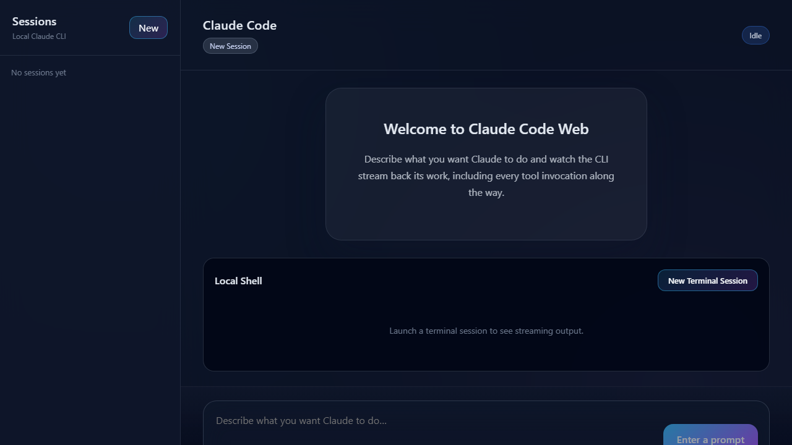
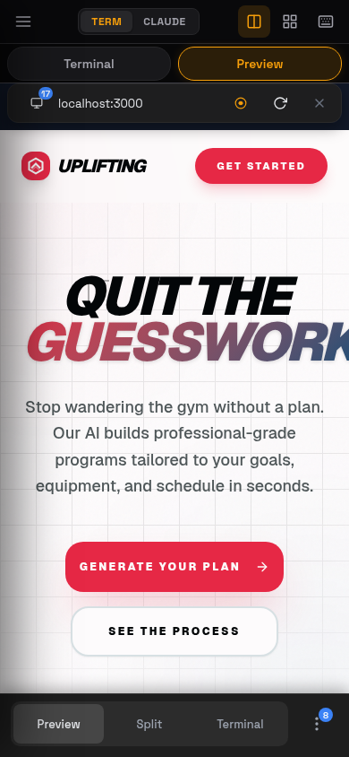
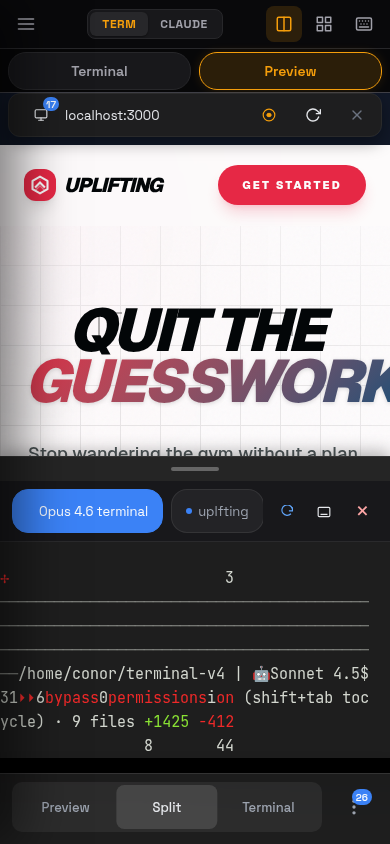

# Terminal v4 - Web Terminal and Claude Code Workspace

Terminal v4 is a browser-based terminal workspace with full PTY sessions, Claude Code streaming, preview tooling, and a mobile-friendly UI. It is built for running real shell workflows in the browser while keeping terminals, previews, and debugging tools in one place.

## Screenshots

<p align="center">
  
</p>

<p align="center">
  
  
</p>

## Features

- 🖥️ **Full PTY Support** - Run interactive programs (Claude CLI, Python REPL, vim, etc.) with optional tmux persistence
- 🎨 **xterm.js Terminal** - Professional terminal UI with ANSI colors and WebGL acceleration
- 🔄 **Multiple Sessions** - Create and manage unlimited terminal sessions with split-pane layouts
- 🤖 **Claude Code Integration** - Native Claude CLI with SSE streaming and multiple sessions
- 🔍 **Preview & DevTools** - Preview local dev servers with console, network, storage, and performance monitoring
- 📁 **File Management** - Upload, download, rename, delete, and unzip files
- 📊 **System Monitoring** - Real-time CPU, RAM, disk I/O stats with historical tracking
- 🎤 **Voice Input** - AI-powered voice-to-text with Groq Whisper
- 📱 **Mobile Optimized** - Touch gestures, mobile keybar, and responsive UI
- 📸 **Screenshots & Recording** - Capture screenshots and record videos of preview panels
- 📝 **Bookmarks & Notes** - Save commands and project notes
- 🌐 **Remote Access** - Access your terminal from any browser with JWT authentication

See [FEATURES.md](docs/FEATURES.md) for a comprehensive feature catalog.

## Requirements

- Node.js 18+ (Node.js 22 recommended for node-pty prebuilt compatibility)
- Windows (PowerShell/cmd), macOS, or Linux

## Quick Start

See [Quick Start Guide](docs/QUICK_START.md) for detailed setup instructions.

**TL;DR:**
1. Install dependencies: `cd backend && npm install && cd ../frontend && npm install`
2. Create `.env` with JWT secrets and optional API keys
3. Start backend: `cd backend && npm run dev`
4. Start frontend: `cd frontend && npm run dev`
5. Open `http://localhost:5173` and create your first terminal!

## Windows Desktop (Phase 1)

Terminal v4 now includes a Windows desktop wrapper scaffold using Tauri.

```bash
# From repo root
npm run desktop:dev
```

What this does:
- Builds `frontend/dist` and `backend/dist`
- Starts the backend in desktop local-only mode (`HOST=127.0.0.1`, `PORT=3020`)
- Launches a native Tauri window pointed at `http://127.0.0.1:3020`

Build command:

```bash
npm run desktop:build
```

See [Windows Desktop Development](docs/development/WINDOWS_DESKTOP_DEVELOPMENT.md) for full setup details.

## Project Structure

```
terminal-v4/
├── backend/              # Fastify server with PTY support
│   ├── src/
│   │   ├── index.ts      # Main server entry point
│   │   ├── terminal/     # Terminal manager with PTY
│   │   └── routes/       # API route handlers & schemas
│   ├── test/             # Vitest test suite
│   └── package.json
├── frontend/             # React + Vite frontend
│   ├── src/
│   │   ├── App.jsx       # Main app with session sidebar & settings
│   │   ├── styles.css    # Application styles
│   │   └── components/
│   │       └── TerminalChat.jsx  # xterm.js integration
│   └── package.json
└── docs/
    ├── architecture/     # System architecture docs
    └── development/      # Setup and testing guides
```

## API Endpoints

### Terminal Management
- `POST /api/terminal` - Create new terminal session (accepts `cwd` for working directory)
- `GET /api/terminal` - List all terminal sessions
- `GET /api/terminal/:id/history` - Get terminal output history
- `GET /api/terminal/:id/ws` - WebSocket stream for real-time input/output
- `POST /api/terminal/:id/input` - Send input to terminal
- `DELETE /api/terminal/:id` - Close/terminate terminal session

### Health Check
- `GET /api/health` - Server health status

## Configuration

### Backend Environment Variables

- `PORT` - Backend server port (default: `3020`)
- `HOST` - Server host (default: `0.0.0.0`)
- `LOG_LEVEL` - Logging level (default: `info`)
- `TERMINAL_DATA_DIR` - Override backend data directory (default: `backend/data`)
- `JWT_SECRET` - JWT signing secret (required in production)
- `REFRESH_SECRET` - Refresh token signing secret (required in production)
- `ALLOWED_USERNAME` - Only this username is allowed to authenticate
- `UNRESTRICTED_PREVIEW` - When set to `true`, removes preview port limits (use with care on exposed deployments)
- `REBUILD_PROJECT_ROOT` - Override project root used by `/api/system/rebuild` (default: repo root)
- `REBUILD_SCRIPT_PATH` - Override rebuild script path (default: `<project-root>/rebuild.sh`)
- `REBUILD_SCRIPT_WINDOWS_PS1` - Optional Windows PowerShell rebuild script path
- `REBUILD_SCRIPT_WINDOWS_CMD` - Optional Windows cmd rebuild script path

### Default Shell

The terminal automatically detects your system's default shell:
- **Windows**: `cmd.exe` or `PowerShell`
- **macOS/Linux**: `$SHELL` or `/bin/bash`

## Usage Examples

### Basic Commands
```bash
dir                    # List files (Windows)
ls                     # List files (Unix)
cd path/to/folder     # Change directory
python                # Start Python REPL
node                  # Start Node.js REPL
```

### Interactive Programs
```bash
claude                # Start Claude CLI interactive mode
vim file.txt          # Edit files with vim
python script.py      # Run Python scripts
npm install           # Install packages
git status            # Git operations
```

## Architecture Highlights

- **Backend**: Fastify + TypeScript for high-performance async I/O
- **PTY**: `@homebridge/node-pty-prebuilt-multiarch` for true terminal emulation
- **Frontend**: React + xterm.js for professional terminal UI
- **Communication**: WebSocket for real-time streaming
- **Session Management**: In-memory store with multi-session support

## Security Considerations

⚠️ **Internet Exposure Requires Hardening**

This app provides full shell access to the host. If exposed to the internet:
- Ensure `JWT_SECRET` and `REFRESH_SECRET` are set to strong values
- Set `ALLOWED_USERNAME` so only your account can log in
- Use HTTPS/TLS (terminate at a reverse proxy or load balancer)
- Add rate limiting or a WAF in front of `/api/auth/login`
- Keep host OS and dependencies patched

See `docs/architecture/SYSTEM_ARCHITECTURE.md` for detailed security recommendations.

## Documentation

### Architecture
- 📖 [System Architecture](docs/architecture/SYSTEM_ARCHITECTURE.md) - Complete system design and components
- 🔌 [API Architecture](docs/architecture/API_ARCHITECTURE.md) - API endpoints and patterns
- 🗄️ [Database Schema](docs/architecture/DATABASE_SCHEMA.md) - Data storage structure

### Development
- 🛠️ [Development Setup](docs/development/SETUP.md) - Local development guide
- 🧪 [Testing Guide](docs/development/TESTING_GUIDE.md) - Running and writing tests

### Features & Usage
- ⭐ [Features Catalog](docs/FEATURES.md) - Comprehensive feature list
- ⌨️ [Keyboard Shortcuts](docs/KEYBOARD_SHORTCUTS.md) - Shortcuts and gestures reference
- 📋 [CLAUDE.md](CLAUDE.md) - Universal best practices guide

### Troubleshooting
- 🔧 [Common Issues](docs/troubleshooting/COMMON_ISSUES.md) - Solutions to frequent problems

## Testing

Run the test suite:
```bash
cd backend
npm test              # Run all tests
npm run test:watch   # Watch mode
```

## Troubleshooting

### Terminal not responding
- Refresh browser and create a new terminal session
- Check backend logs for errors
- Ensure PTY dependencies installed correctly

### ANSI codes showing as text
- Hard refresh browser (`Ctrl+F5`)
- Check xterm.js dependencies loaded
- Clear Vite cache: `rm -rf frontend/node_modules/.vite`

### Node.js version issues
- Supports Node.js 18+ (Node.js 22 recommended for node-pty prebuilt compatibility)
- Use `nvm` to switch Node versions if needed

## Contributing

1. Follow Conventional Commits format for commit messages
2. Run tests before committing: `npm test`
3. Update documentation for significant changes
4. See `CLAUDE.md` for coding standards

## License

MIT

## Acknowledgments

- Built with [xterm.js](https://xtermjs.org/) for terminal emulation
- Uses [node-pty](https://github.com/microsoft/node-pty) for PTY support
- Powered by [Fastify](https://www.fastify.io/) and [React](https://reactjs.org/)
